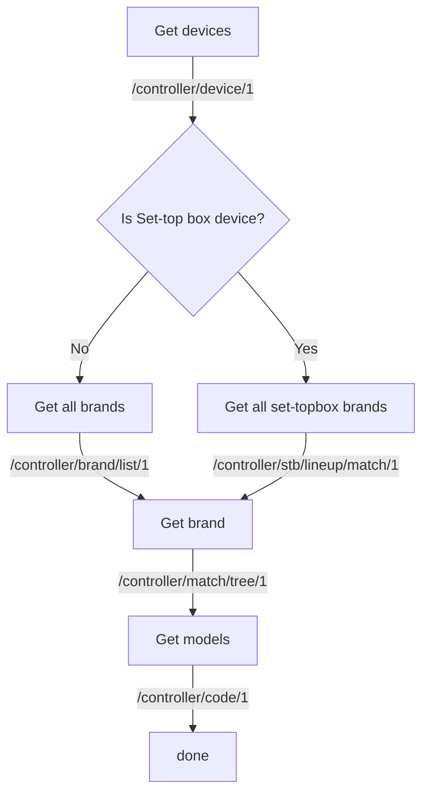

You will find on this repository a proof of concept aiming to reproduce and query the infrared
code database used by the Xiaomi *Mi Remote* application.

The codes are decrypted and can be converted into a number of formats.

This will hopefully allow the creation or improvement of free and gratis alternatives
(and not just gratis with behavioral tracking).

You will find a write-up about this project on the following site:
[reversing Xiaomi Mi Remote (in French)](https://pro-domo.ddns.net/blog/retro-ingenierie-dune-application-android-xiaomi-mi-remote-partie-1.html)

Full database and [TVKILL](https://github.com/42SK/TVKILL/) exports are available in the assets of the GitHub release page.

# Data overview

Data from the DB could be localized (not really studied at the moment);
however, codes are currently queried for France and by extension for Europe (I guess...).

Please note that the following numbers are for *power codes* (ON/OFF codes) **only**
(`python -m src db_export -f flipper -k power power_r -d xxx`).
The number of patterns for other commands **is much more important** (see below).

    TV codes:
    Nb brands: 1060
    Nb models: 2848
    Nb unique patterns: 1346

    Set-top box:
    Nb brands: 43
    Nb models: 172
    Nb unique patterns: 134

    Air conditioners:
    Nb brands: 280
    Nb models: 1828
    Nb unique patterns: ??
    (much more in fact, but patterns are crypted and not reversed for now)

    DVD players:
    Nb brands: 247
    Nb models: 839
    Nb unique patterns: 775

    Fans:
    Nb brands: 133
    Nb models: 422
    Nb unique patterns: 191

    Audio/video:
    Nb brands: 202
    Nb models: 455
    Nb unique patterns: 446

    Projectors:
    Nb brands: 118
    Nb models: 370
    Nb unique patterns: 274

    Cable _ Satellite box
    Nb brands: 2
    Nb models: 13
    Unique patterns: 14

    Internet Box:
    Nb brands: 136
    Nb models: 221
    Nb unique patterns: 140

    Camera:
    Nb brands: 12
    Nb models: 18
    Nb unique patterns: 4

Stats for all key codes (`python -m src db_export -f flipper -d xxx`):

    TV codes:
    Nb brands: 1060
    Nb models: 2848
    Unique patterns: 46228

    Set-top box:
    Nb brands: 43
    Nb models: 172
    Unique patterns: 3134

    Air conditioners:
    Nb brands: 280
    Nb models: 1828
    Unique patterns: 507

    DVD players:
    Nb brands: 247
    Nb models: 839
    Unique patterns: 25954

    Fans:
    Nb brands: 133
    Nb models: 422
    Unique patterns: 1435

    Audio/video:
    Nb brands: 202
    Nb models: 455
    Unique patterns: 8615

    Projectors:
    Nb brands: 118
    Nb models: 370
    Unique patterns: 5518

    Cable _ Satellite box
    Nb brands: 2
    Nb models: 13
    Unique patterns: 548

    Internet Box:
    Nb brands: 136
    Nb models: 221
    Unique patterns: 4031

    Camera:
    Nb brands: 12
    Nb models: 18
    Unique patterns: 113

# Installation

The project is written for Python 3.6+:

    $ pip install -r requirements.txt

# Usage

Get some help:

    $ python -m src --help

- Dump the database (If you don't want to use the one that is available in the
GitHub assets, or if you want to update it).

        $ python -m src db_dump
        # or just:
        $ make db_dump

    Have coffee in the meantime... Files are in the directory `./database_dump` by default.

    If you just want to make an update, delete the *.json files in `./database_dump`
    but **keep files** in `models` directories.

- List the known devices types in the dump:

        $ python -m src db_stats -ld
        Device Name: Device ID
        TV: 1
        Set-top box: 2
        AC: 3
        Fan: 6
        Box: 12
        A_V receiver: 8
        DVD: 4
        Projector: 10
        Cable _ Satellite box: 11
        Camera: 13

- List the known brands for a specific device:

        $ python -m src db_stats -lb -d 2
        Brands for 'Set-top box' device:
        dict_keys(['Home Digital_in137', 'ACT Digital_in112', 'Airtel_in100', ...])
        # See the 2 parts for each name: `brandname_internalid`.
        # 1 of them or both can be used later.

    With **these ids & names you will be able to export codes for a
    specific device or brand**, like shown in the next section.
    Other formats can be easily implemented by someone who needs it.

- Filtering brand and key names is possible by using `--brands` and
 `--keys` argument:

        $ python -m src db_export -d 1 --brands Fujitsu Sony -k power power_r -f flipper
        ...
        Nb brands: 2
        Nb models: 10
        Unique patterns: 382

    Note: Currently, its only for the `flipper` export.

## TV Kill Android app

Export IR codes for one device type to the format of [TVKILL](https://github.com/42SK/TVKILL/) Android app.
The number `1` in the command is the internal device id in the database (see above).

    $ python -m src db_export -d 1 -f tvkill

A JSON file (`Xiaomi_TV.json`) will be exported with the following structure as example:

    [
        {
            "designation": "Xiaomi Projector",
            "patterns": [
            {
                "comment": "kk 111_6667",
                "frequency": 37960,
                "pattern": [
                    341,171,20,22,20,...
                ]
            }
        }
    ]

## Flipper Zero

Export is also available for
[Flipper Zero](https://github.com/flipperdevices/flipperzero-firmware).
The number `1` in the command is the internal device id in the database (see above).

    $ python -m src db_export -d 1 -f flipper

`ir` files will be exported with the following structure:

    Filetype: IR signals file
    Version: 1
    # Comments
    #
    name: down
    type: raw
    frequency: 38000
    duty_cycle: 0.330000
    data: ...

# Developers

Functions are fully documented in the source code according to Python documentation standards;
moreover, some examples are available in unit tests.

## Data structure

    .
    ├── database_dump
    │   ├── 10_Projector.json # "Device" file: List of brands for this type of device (HP, Epson, Philips, etc.)
    │   ├── 10_Projector      # "Brands" directory: 1 file per brand
    │   │   ├── 3M_1.json     # "Brand" file: each file contains multiple models references with (most of the time) their *power* code
    │   │   ├── ...
    │   │   ├── models        # "Models" directory: 1 file per model
    │   │   │   ├── 1_8582.json # "Model" file: Definitions of all IR codes known for one model
    │   │   │   ├── ...

## Online API description & flowchart

## Pattern object

Pattern is a wrapper for IR pulses format.

One pulse is the number of cycles of the carrier for which to turn the
emitter light ON or OFF. Pulses are used for IR transmission based on PWM
(Pulses Width Modulation) where the carrier frequency acts as a clock.

Timmings are expressed in microseconds (us or µs),
Burst/pulse values are expressed in number of cycles of the carrier for which
to turn the light on and off.

Supported formats:

- raw: Timmings in microseconds (us)
- signed raw: Same as raw but positive values are for ON time,
    and negative ones for OFF time.
- pronto: Hex values embedding the carrier frequency, metadata about
    the length of the 2 embedded sequences, and the burst/pulse pairs.
- pulses: Numerical values of the pulse pairs.

Conversion methods available (See in-code documentation):

    to_pronto
    from_pronto
    from_pulses
    to_raw
    to_signed_raw
    to_pulses

Examples:

    >>> pronto = "0000 0071 0000 0002 0000 00AA 0000 0040 0000 0040 0000 0015"
    >>> pattern = Pattern(pronto, None, code_type="pronto")

    >>> ir_code = [9042,4484,579,552,580,567,579,567,544,554]
    >>> pattern = Pattern(ir_code, 37990, code_type="raw")

Python sets can be made to ensure the uniqueness of Pattern objects.

## Cast crypted IR code from database to raw timmings (µs)

    >>> mi = "QJPmll3+SCgpSE73bTO9hni9upbSpKrS73cugR4FZSMT2VGtMTkEIsegm1kjFy3bCLQJsJZKAXxjDF7hGaYIolNzR+qo5f2H3C/PqsSK2Q8kaQaJAycytxhqhVgnwnOUZ6gj0xXscdkPK3MBzr6HH5yEOGDtocCXKP8qEXZdvctnCmFZaZwubXf1Cscf/rlVkAz53JacxfUkCiDqw8M27g=="
    >>> ir_code = process_xiaomi_shit(mi)

## Load codes from a directory

    >>> codes = load_device_codes("./database_dump/1_TV/")

Some brands have an additional section named "others" in the JSON response.
Currently this section *is used* to retrieve codes.
This influences the number of codes collected.

For exemple, for TV codes:

    Without others section:
    Nb brands: 1060
    Nb models: 2302
    Nb Patterns: 2625

    With others section:
    Nb brands: 1060
    Nb models: 2634
    Nb Patterns: 2998
    Nb unique patterns: 1290
    1236 unique IR codes (without frequency param)

# Contributing

Feedback in issues is important and pull-requests are welcome,
but time could be missing to implement large functionality requests ;)

## Thanks

@LionZXY (Help with Flipper Zero support #3).
@Biswa96 (Bug fixes).
